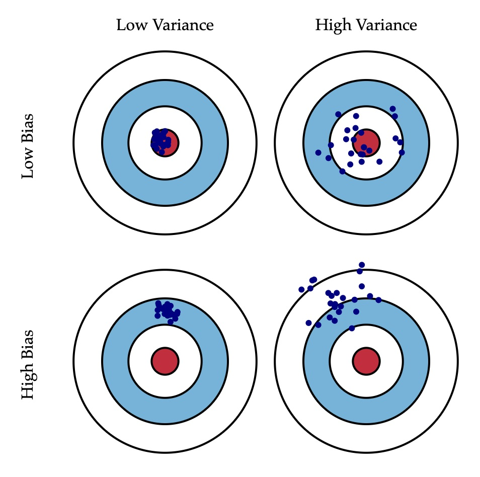

# Lecture 1 - Linear Regression

## Model Selection

When 2 models both fit the training data equally well, which one should we choose?

- use validation data and choose the better one
  
  - 一般来说 train : valid : test = 8:1:1

  - 一般over-fit时error on validation data会上升

- choose a simpler one (if without validation data)

  - Occam's Razor(奥卡姆剃刀准则)：如无必要，勿增实体

  - Inductive bias

## Bias-Variance Decomposition

- $D$ is a training set and $D = \{(x_1, y_1), \dots, (x_n, y_n)\}$  ($D \sim P(D) $)
  - 也就是说用由分布$P(D)$采样出来的D训练一个模型$f(x;D)$
- 对于一个测试数据$(x,y)$，平方误差的期望为 $E_D[f(x;D)-y]^2$
  - which means average error of $f(x;D)$ over infinitely many $D \sim P(D)$
  - we define $\bar{f}(x):=E_D[f(x;D)-y]$
  - now we have:
    $$
    \begin{align*}
      E_D[f(x;D)-y]^2 &=E_D[f(x;D)-\bar{f}(x) + \bar{f}(x) - y]^2 \\
        &= E_D[f(x;D)-\bar{f}(x)]^2 + 2E_D[f(x;D)-\bar{f}(x)] [\bar{f}(x)-y] + E_D[\bar{f}(x)-y]^2 \\
        &=E_D[f(x;D)-\bar{f}(x)]^2 + (\bar{f}(x)-y)^2 \\
        &=\text{Variance}+\text{Bias}^2 \\
        (&E_D[f(x;D)-\bar{f}(x)] = 0 )
    \end{align*}
    $$
  - Variance: error caused by over-fitting particular $D$ can be decreased by increasing the size _n_ of $D$  
    简单来说即是测试的预测与平均预测之差的平方
  - Bias: error caused by the model's ability to fit the data, or the model is not complex enough  
    即平均预测与标签也就是实际值之差
- Trade-off
  - simple model: high bias, low variance
  - complex model: low bias, high variance
{width=50% height=auto}
- One more thing
  - $\bar{f}(x) = E_D(f(x;D))$ is an average model over infinitely sample small $D$
  - $\hat{f}(x) = f(x;D,|D|\rightarrow \infin)$ is a model trained over an infinitely large $D$
  - 虽然上述推导使用了第一个函数，但在实际过程中数据自然越多越好，那么也就是第二个模型往往表现更好
  - example:
    $$
    P(D) = \left\{
    \begin{aligned}
    1/3 & & \{(-1,1),(0,0)\} \\
    1/3 & & \{(1,1),(0,0)\} \\
    1/3 & & \{(-1,1),(1,1)\}
    \end{aligned}
    \right.
    $$
    - $\bar{f}(x) = 1/3$, $variance > 0$, $bias^2 = 1$
    - $\hat{f}(x) = 2/3$, $variance = 0$, $bias^2 = 2/3$

## Linear Regression

### Basic Model

- $D$ is a training set and $D = \{(x_1, y_1), \dots, (x_n, y_n)\}$. $x_i \in \mathbb{R}^d, \ y_i \in \mathbb{R}, \ i=1,2,\dots,n$  
  We are going to train a model $y=w^T x+b, \ w \in \mathbb{R}^d, \ b \in \mathbb{R}$
- How to determine $w, b$
  - _ERM(Empirical Risk Minimization)_
- Loss function
  - **squared loss** $(f(x_i)-y_i)^2$
- Objective:
  $$
    \begin{align*}
      &\mathop{min}\limits_{w,b} \sum_{i=1}^n (f(x_i)-y_i)^2 \\
      = &\mathop{min}\limits_{w,b} \sum_{i=1}^n (w^T x_i + b - y_i)^2 := L(w,b)
    \end{align*}
  $$

- Gradient:
  $$
    \begin{align*}
      \frac{\partial L}{\partial w} &= 2 \sum_{i=1}^n(w^T x_i + b - y_i)x_i \\
      \frac{\partial L}{\partial b} &= 2 \sum_{i=1}^n(w^T x_i + b - y_i)
    \end{align*}
  $$
  注意这里是一个向量对标量求梯度，结果还是一个向量

- Gradient Descent
  $$
    \begin{align*}
      w &\leftarrow w - \alpha \frac{\partial L}{\partial w} \\[3mm]
      b &\leftarrow b - \alpha \frac{\partial L}{\partial b}
    \end{align*}
  $$
  $\alpha$ is the **learning rate** and it's a **hyperparameter**

- 常用公式(已知$w\in\mathbb{R}^d$)
  $$
    \begin{align*}
      \frac{\partial w^Tw}{\partial w} &= 2 w \\[3mm]
      \frac{\partial w^Tx}{\partial x} &= w \\[3mm]
      \frac{\partial x^TAx}{\partial x} &= (A + A^T)x
    \end{align*}
  $$

### Least Squares

- Least squares actually has closed-form solution! (which also regards as **Normal Equation**)
- we need some vectorized variables:
  $$
    \begin{align*}
      x &= \begin{bmatrix}
          x_1^T, 1\\
          x_2^T, 1\\
          \dots \\
          x_n^T, 1
      \end{bmatrix} \in \mathbb{R}^{n \times (d+1)}\\
      \hat{w} &= \begin{bmatrix}
          w\\b
      \end{bmatrix} \in \mathbb{R}^{d+1}\\
      y &= \begin{bmatrix}
          y_1\\
          \dots\\
          y_n
      \end{bmatrix} \in \mathbb{R}^n
    \end{align*}
  $$
- the loss function now looks like this:
  $$
      L(\hat{w}) = (y-x\hat{w})^T (y-x\hat{w})
  $$
  because we know that:
  $$
      x\hat{w} = \begin{bmatrix}
          f(x_1)\\
          \dots \\
          f(x_n)
      \end{bmatrix}
  $$
- to compute $\hat{w}$ we want the gradient to be 0
  $$
    \begin{align*}
      \frac{\partial L(\hat{w})}{\partial \hat{w}} &= \frac{\partial [(y-x\hat{w})^T (y-x\hat{w})]}{\partial \hat{w}} \\[3mm]
      &= \frac{\partial (y^T y - y^T x \hat{w} - \hat{w}^T x^T y + \hat{w}^T x^T x \hat{w})}{\partial \hat{w}} \\[3mm]
      &= \frac{\partial (y^T y - 2 y^T x \hat{w} + \hat{w}^T x^T x \hat{w})}{\partial \hat{w}} \\[3mm]
      &= -2x^Ty  + 2x^T x \hat{w} = 0
    \end{align*}
  $$

- now we focus on $x^Tx$:
  - 我们知道$x^Tx$是一个实对称矩阵，那么它是半正定的，也就是说该矩阵的特征值都是大于等于0的
  - 如果$x^Tx$不满秩，那么显然这个方程里$\hat{w}$是可能有多于一个解的，造成这种结果的可能原因是：
    - $d+1>n$:
      - $rank(x^Tx) = rank(x) \leq \ min\{d+1, n\}$
    - $x$ has repeated columns or rows
  - 如果$x^Tx$满秩，则特征值都大于0，我们可以对其进行特征值分解：
    $$
      \begin{align*}
        x^Tx &= U \Lambda U^T \\
        &= U \begin{bmatrix}
            \lambda_1 & & \\
            &\dots& \\
            & & \lambda_{d+1}
        \end{bmatrix} U^T\\
        (x^Tx)^{-1} &= U \Lambda^{-1} U^T \\
        &= U \begin{bmatrix}
            \lambda_1^{-1} & & \\
            &\dots& \\
            & & \lambda_{d+1}^{-1}
        \end{bmatrix} U^T
      \end{align*}
    $$
    - 那么这个方程有**唯一解** $\hat{w} = (x^T x)^{-1} x^T y$
    - 但依然有一个问题，就是$\lambda_{d+1}$可能很接近0，也就是$x^Tx$很接近一个非奇异矩阵，这就导致$ \lambda_{d+1}^{-1} $会相当大，因此会导致计算上的问题(**numerical issues and instability**)

### L2 Regularization

- Linear Regression with L2 Regularization (Ridge Regression):
  $$
      min L(\hat{w}) + \lambda ||\hat{w}||_2^2
  $$
  - $\lambda$ is a positive **constant hyperparameter** which can control the strength of regularization (weight decay)
  - 简单来说就是避免某个$w$特别突出，使所有的$w$更平均一些
- loss function with L2 Regularization
  $$
      J(\hat{w}) = (y-x\hat{w})^T (y-x\hat{w}) + \lambda w^T w \ \ (\lambda > 0)
  $$
- compute the gradient:
  $$
    \begin{align*}
      \frac{\partial J(\hat{w})}{\partial \hat{w}} &= -2x^T y + 2 x^T x \hat{w} + 2 \lambda \hat{w} \\
      &= -2 x^T y + 2(x^T x + \lambda I) \hat{w} = 0
    \end{align*}
  $$
- 这是我们再对$x^T x + \lambda I$进行特征值分解，就可以得到:
  $$
    \begin{align*}
      x^T x + \lambda I &= U (\Lambda + \lambda I) U^T \\
      &= U \begin{bmatrix}
          \lambda_1+\lambda & &\\
          &\dots& \\
          & & \lambda_{d+1}+\lambda
      \end{bmatrix} U^T
    \end{align*}
  $$
  so $x^T x + \lambda I$ is always **non-singular** and $\hat{w}$ is a unique solution!
  $$
      \hat{w} = (x^T x + \lambda I)^{-1} x^T y
  $$

### L1 Regularization

- Linear Regression with L1 Regularization (Lasso Regression):
  $$
    \begin{align*}
      &\mathop{min} L(\hat{w}) + \lambda ||\hat{w}||_1 \\
      = &\mathop{min} L(\hat{w}) + \lambda \sum_{i=1}^{d+1}|\hat{w_i}|
    \end{align*}
  $$
  - induce sparsity of $\hat{w}$ (many dimensions of $\hat{w}$ will be 0)
  - Lasso stands for _Least Absolute Shrinkage and Selection Operator_
    - feature selection: 当参数很多时，用L1正则化可以筛选出真正有用的参数

### Geometric view of Linear Regression

- Ideally, we want $X\hat{W}=y$
- 但是显然我们没办法找到一个model可以fit任何数据
- Consider the column space of $X$ as $col(X)$,  spanned by columns of $X$
  - $X\hat{W}$ lies in $col(X)$, but $y$ may not
  - let $X\hat{W} = \hat{y}$, this $\hat{W}$ is the least square solution to $X\hat{W}=y$
  - Because $\hat{y}$ minimizes $||y-X\hat{W}||^2$, which is the object of Linear Regression, $\hat{y}(X\hat{W})$ should satisfy $y-\hat{y} \perp col(X) \leftrightarrow X^T(y-\hat{y}) = 0 \leftrightarrow X^TX\hat{W} = X^Ty $
