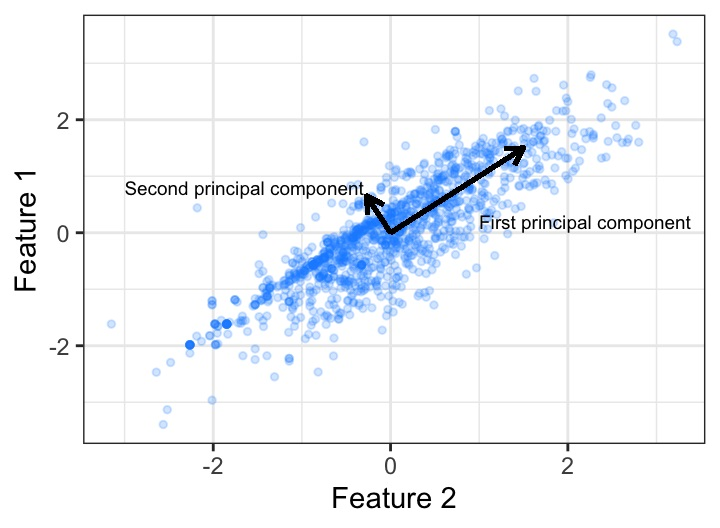
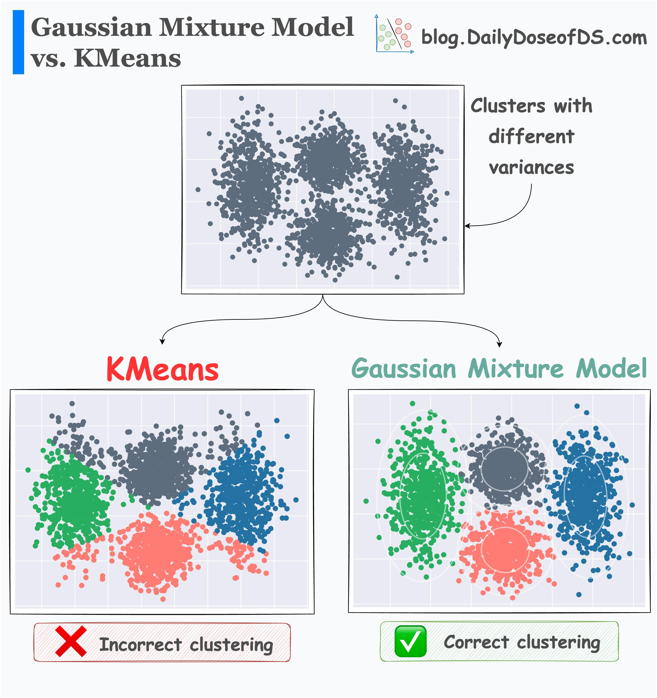

# Unsupervised Learning

- $x$ only, no $y$, learn $P(x)$
- Tasks
  1. **Dimensionality Reduction**: $x\in\mathbb{R}^{10000}\rightarrow x\in\mathbb{R}^{100}$
  2. **Clustering**: group similar data together
  3. **Generating Models**: sample new data from $P(x)$

## Principal Component Analysis (PCA)

- $x^{(1)}$ and $x^{(2)}$ are highly correlated
  - Principles: find a new basis $u_1$ and $u_2$  
    s.t. $u_1 \bot u_2$, $u_1$ keeps the most **information** (**data variance** on $u_1$ is the largest)  
    then throw away $u_2$. Represent a sample $x$ by $x^Tu_1$

### PCA derivation

- We have
  $$
    \begin{align*}
        X=\begin{pmatrix*}
            x_1^T \\ \vdots \\ x_n^T
        \end{pmatrix*}\in\mathbb{R}^{n\times d}
    \end{align*}
  $$  
  then we can calculate the mean and the covariance matrix (it's a _real symmetric_ matrix)
  $$
    \begin{align*}
        \bar{x}&=\frac{1}{n}\sum_{i=1}^nx_i\in\mathbb{R}^d\\
        \Sigma &= \frac{1}{n}\sum_{i=1}^n(x_i-\bar{x})(x_i-\bar{x})^T \in\mathbb{R}^{d\times d}
    \end{align*}
  $$
- Now compute $u_1\in\mathbb{R}^d$, we need to project each $x_i$ to $u_1$ and maximize variance
  $$
    \begin{align*}
        &\frac{1}{n}\sum_{i=1}^n(u_1^Tx_i-u_1^T\bar{x})^2\\
        =&\frac{1}{n}\sum_{i=1}^nu_1^T(x_i-\bar{x})(x_i-\bar{x})^Tu_1\\
        =&u_1^T\Sigma u_1\\
        \Rightarrow \quad& \mathop{max}\limits_{u_1}u_1^T\Sigma u_1\quad \text{s.t.} \ \  u_1^Tu_1=1
    \end{align*}
  $$
  We can use Lagrange function
  $$
    \begin{align*}
        L(u_1,\lambda_1)&=u_1^T\Sigma u_1+\lambda_1(1-u_1^T u_1)\\
        \frac{\partial L}{\partial u_1}&=2\Sigma u_1-2\lambda_1u_1=0\\
        \Rightarrow \quad& \Sigma u_1=\lambda_1u_1
    \end{align*}
  $$
  This means that $u_1$ is an **eigenvector** of $\Sigma$ corresponding to **eigenvalue** $\lambda_1$
  $$
    \begin{align*}
        u_1^T\Sigma u_1 =\lambda_1 u_1^T u_1 = \lambda_1
    \end{align*}
  $$
  We need to find **maximum eigenvalue** to maximize $u_1^T\Sigma u_1$
- Next, find $u_2$, the next direction that preserves the most variance ($u_2$ should be **orthogonal** to $u_1$)
  $$
    \begin{align*}
        \mathop{max}\limits_{u_2} u_2^T\Sigma u_2 \quad \text{s.t.} \ \ u_2^Tu_2=1, \ \ u_2^Tu_1=0
    \end{align*}
  $$
  Again, use Lagrange function
  $$
    \begin{align*}
        L(u_2,\lambda_2,\alpha)&=u_2^T \Sigma u_2+\lambda_2(1-u_2^Tu_2)+\alpha u_2^T u_2\\
        \frac{\partial L}{\partial u_2}&=2\Sigma u_2-2\lambda_2 u_2+\alpha u_1=0\\
        \Rightarrow \quad & 2u_1^T\Sigma u_2-2\lambda_2 u_1^T u_2+\alpha u_1^T u_1\\
        =&2u_2^T \Sigma u_1+\alpha\\
        =&2\lambda_1u_2^Tu_1+\alpha=0\\
        \Rightarrow \quad & \alpha =0\\
        \Rightarrow \quad & \Sigma u_2=\lambda_2 u_2\\
        &u_2^T\Sigma u_2=\lambda_2 u_2^T u_2 = \lambda_2
    \end{align*}
  $$
  This means that $u_2$ is the second largest **eigenvector** of $\Sigma$ corresponding to eigenvalue $\lambda_2$
- By induction, when we need $K$ principle components, just compute $K$ **largest eigenvalues and eigenvectors**  
  $U_k=(u_1,\dots,u_k)\in\mathbb{R}^{d\times k}$, project $X$ by $XU_k\in\mathbb{R}^{n\times k}$ ($k$ << $d$)
  $$
    \begin{align*}
        \Sigma &= U\Lambda U^T\\
        &=\begin{pmatrix*}
            u_1 & \dots & u_d
        \end{pmatrix*}
        \begin{pmatrix*}
            \lambda_1 & &\\
            & \ddots & \\
            & & \lambda_d
        \end{pmatrix*}
        \begin{pmatrix*}
            u_1^T \\ \vdots \\ u_d^T
        \end{pmatrix*}
    \end{align*}
  $$
  - $\Lambda$ is diagonal and $U$ is orthogonal
- Another representation of $\Sigma$
  $$
    \begin{align*}
        \hat{X}=\begin{pmatrix*}
            x_1^T-\bar{x}^T\\
            \vdots\\
            x_n^T-\bar{x}^T
        \end{pmatrix*}\in\mathbb{R}^{n\times d}
    \end{align*}
  $$
  then
  $$
    \begin{align*}
        \Sigma = \frac{1}{n}\hat{X}^T\hat{X}
    \end{align*}
  $$
  We can directly do eigen-decomposition for $\hat{X}^T\hat{X}$, then $U$ will be the same, $\lambda_i$ only scales by a factor
- Alternatively, we can perform **Singular Value Decomposition (SVD)** for $\hat{X}^T=U\hat{\Sigma}V^T$, $U\in\mathbb{R}^{d\times d}$, $V\in\mathbb{R}^{n\times n}$, $U$ and $V$ are orthogonal
  $$
    \begin{align*}
        \hat{X}^T\hat{X}&=U\hat{\Sigma}V^TV\hat{\Sigma}^TU^T\\
        &=U(\hat{\Sigma}\hat{\Sigma}^T)U^T\\
        \hat{\Sigma}&=\begin{pmatrix*}
            \sigma_1 & & \\
            & \ddots & &0&\\
            & & \sigma_d
        \end{pmatrix*}\\
        \hat{\Sigma}\hat{\Sigma}^T&=\begin{pmatrix*}
            \sigma_1^2 & &\\
            & \ddots & \\
            &&\sigma_d^2
        \end{pmatrix*}=\Lambda
    \end{align*}
  $$
  which means that $\sigma_i^2=\lambda_i$

## Clustering

- Given $D=\{x_1,\dots,x_n\}\in\mathbb{R}^d$, we want to **partition** $D$ into $K$ clusters
  - $K$ is a hyperparameter
  - $\mu_k\in\mathbb{R}^d$ is the center of cluster $k$
  - $r_{ik}\in\{0,1\}$ denotes that $x_i$ is closet to $\mu_k$
    - $r_{ik}$ is called **assignment**
    - $\sum_{k=1}^Kr_{ik}=1\quad \forall i$

### K-means Clustering Algorithm

- Find $\{\mu_k\vert k=1,\dots,K\}$ and $\{r_{ik}\}$  
  s.t. the sum of squared distances of each $x_i$ to its assigned cluster center $\mu_k$ is minimized  
  **Objective**:
  $$
    \mathop{min}\limits_{r,\mu}\sum_{i=1}^n\sum_{k=1}^K r_{ik}\Vert x_i-\mu_k \Vert^2
  $$
- Steps: Alternately optimize $\mu$ and $r$
  1. Randomly initialize $\mu_k$
  2. Given $\mu$ fixed, $r_{ik}$ can be updated
   $$
    \begin{align*}
        r_{ik}=\left\{
            \begin{aligned}
                1 & \quad\text{if }k=\mathop{argmin}\limits_{j=1,\dots,K}\Vert x_i-\mu_j \Vert^2\\
                0 & \quad\text{otherwise}
            \end{aligned}
        \right.
    \end{align*}
   $$
      - assign $x_i$ to the closet cluster center
  3. Given $r$ fixed, $\mu$ can be optimized easily
   $$
    \begin{align*}
        \frac{\partial L}{\partial \mu_k}&=-\sum_{i=1}^nr_{ik}(x_i-\mu_k)=0\\
        \Rightarrow\quad\mu_k&=\frac{\sum_{i=1}^nr_{ik}x_i}{\sum_{i=1}^nr_{ik}}
    \end{align*}
   $$
      - calculate the mean of all $x_i$ assigned to $\mu_k$
  4. iterate ii and iii until convergence
      - ii and iii both reduce the _objective_ (must convergence)
- K-means only find local minimum of the _objective_
- In practice, we often run K-means **for multiple times**, each with a different initialization, finally use the one with minimum objective

## Gaussian Mixture Models (GMM)

- Assume points belonging to cluster $k$ follow a Gaussian distribution $N(\mu_k,\Sigma_k)$
- **A generating model**: $P(x)=\sum_zP(x\vert z)P(z)$
- For a random variable $x$, let $z_k\in\{0,1\}$ be another random variable
  - $z_{k}=1$ means $x$ generated from cluster $k$
  - $\sum_{k=1}^K z_k=1$
  $$
    \begin{align*}
        P(x\vert z_k=1)&=N(x\vert \mu_k,\Sigma_k)\\
        P(z_k=1)&=\pi_k\in[0,1], \quad \sum_{k=1}^K\pi_k=1
    \end{align*}
  $$
- Steps:
  1. Randomly initialize $r_{ik}\in[0,1]$
      - $\sum_{k=1}^Kr_{ik}=1$
      - $r_{ik}$ is called **soft assignment(responsibility)** of $x_i$ to $k$
  2. Compute weighted sample mean and covariance according to $r_{ik}$
   $$
    \begin{align*}
        \mu_k&=\frac{\sum_{i=1}^nr_{ik}x_i}{\sum_{i=1}^nr_{ik}}\\
        \Sigma_k&=\frac{\sum_{i=1}^nr_{ik}(x_i-\mu_k)(x_i-\mu_k)^T}{\sum_{i=1}^nr_{ik}}
    \end{align*}
   $$
   and update $\pi$
   $$
    \begin{align*}
        \pi_k=\frac{\sum_{i=1}^nr_{ik}}{n}
    \end{align*}
   $$
  3. Update $r_{ik}$
   $$
    \begin{align*}
        r_{ik}=\frac{\pi_k \ N(x_i\vert \mu_k,\Sigma_k)}{\sum_{j=1}^K\pi_j \ N(x_i\vert\mu_j,\Sigma_j)}
    \end{align*}
   $$
  4. Iterate i to iii until convergence
- $\Sigma_k = \sigma^2I, \ \ \sigma\rightarrow0\quad \Rightarrow \quad\text{GMM}\rightarrow\text{K-means}$

