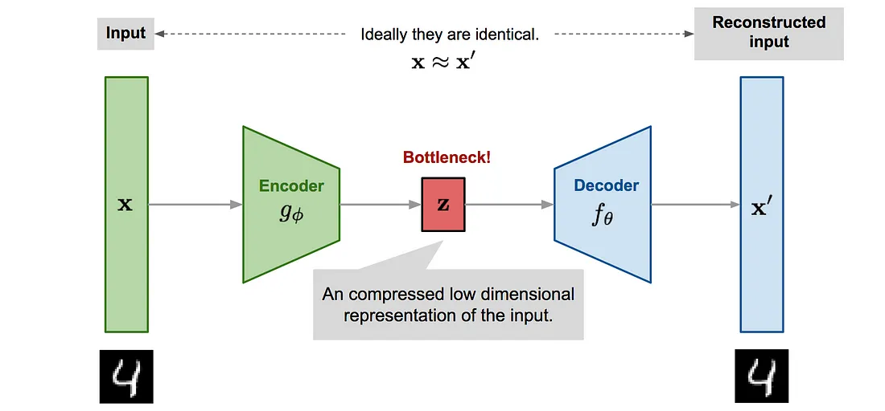
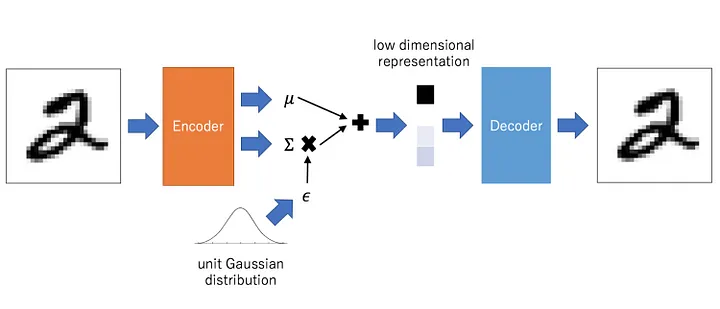

# Variational Auto Encoder

## Auto Encoder

- 将$x$压缩成低维的隐变量$z$，再重新生成$x'$，用$\Vert x-x'\Vert^2$来更新模型
  - 但对于一个生成模型，采样新的$z$并不是一件容易的事情，因为$z$的分布难以得到

## VAE

- Given a set of training samples $D=\{x_1,\dots,x_n\}$, we want to generate new data similar to $D$. In general, sampling from a distribution $x\sim P(x)$ is difficult! Only some distributions are easy to sample from: $U[a,b]$, $N(\mu,\Sigma)$  
  What if we sample $z$ from a simple distribution, then use deterministic $f(z;\theta)$ to map $z$ to $x$ ($z$, $x$ are random variables)?
    $$
        \begin{align*}
            P(x) &= \int p(x\vert z)p(z)dz\\
            z\sim N(0,I)& \quad x\sim N(x\vert f(z;\theta),\sigma^2I)
        \end{align*}
    $$
  - $f$ is some neural network
- **Objective**: MLE of $P(x)$ on $D$ to learn $\theta$
  - Can we sample a large amount of $z$ from $P(z)$ to approximate $P(x)$?  
    $$
        P(x) \approx \frac{1}{N}\sum_{z_i\sim P(z)} P(x\vert z_i)
    $$
    - It doesn't work because $P(z)$ is still high-dimensional, need a super large amount of samples $z_i$ to accurately approximate $P(x)$
  - Can we use MLE of $\log P(x_i)$ with hidden variables $z_i$, which remind us of EM
    $$
    \begin{align*}
        \text{E-step:}&\quad P(z_i\vert x_i;\theta^{old})=\frac{P(x_i\vert z_i;\theta^{old})P(z_i)}{\int_z P(x_i\vert z_i;\theta^{old})P(z_i)dz}\\
        \text{M-step:}&\quad \theta=\argmax_\theta \int_z \log P(x_i,z_i;\theta)P(z_i\vert x_i;\theta^{old})dz
    \end{align*}
    $$
    - EM doesn't work because $P(z\vert x;\theta)$ is **intractable**

### VAE loss

- Find a tractable variational distribution $q(z\vert x;\theta')$ to approximate $P(z\vert x;\theta)$
  $$
  \begin{align*}
    \log P(x;\theta)&=\int_z q(z\vert x;\theta')\log\frac{P(x,z;\theta)}{q(z\vert x;\theta')}dz-\int_z q(z\vert x;\theta')\log\frac{P(z\vert x;\theta)}{q(z\vert x;\theta')}dz\\
    &=\int_z q(z\vert x;\theta')\log\frac{P(x,z;\theta)}{q(z\vert x;\theta')}dz-\text{KL}\bigl(q(z\vert x;\theta')\Vert P(z\vert x;\theta) \bigr)
  \end{align*}
  $$
- **VAE ignores KL and only maximize ELBO!**
  - We just hope KL is small
- Rewrite ELBO:
  $$
    \begin{align*}
        &\int_z q(z\vert x;\theta')\log P(x\vert z;\theta)dz+\int_z q(z\vert x;\theta')\log\frac{P(z)}{q(z\vert x;\theta')}dz\\
        =&\int_z q(z\vert x;\theta')\log P(x\vert z;\theta)dz -\text{KL}\bigl(q(z\vert x;\theta')\Vert P(z) \bigr)
    \end{align*}
  $$
  - first half is called **Reconstruction quality**
    $$
    \int_z q(z\vert x;\theta')\log P(x\vert z;\theta)dz = E_{z\sim q(z\vert x;\theta')}\log P(x\vert z;\theta)
    $$
  - second half regularizes $q(z\vert x;\theta')$ to approximate prior $P(z)$
- Reconstruction quality:
  $$
    \begin{align*}
        P(x\vert z;\theta)&=N(x\vert f(z;\theta),\sigma^2I)\\
        \log P(x\vert z;\theta)&=\log\frac{1}{(2\pi\sigma)^{\frac{d}{2}}}\exp(-\frac{\Vert x-f(z;\theta)\Vert^2}{2\sigma^2})\\
        &=C\Vert x-x' \Vert^2\\
        \text{Reconstruction quality}&= E_{z\sim q(z\vert x;\theta')}\Vert x-x' \Vert^2\\
        &\approx \Vert x-x'\Vert^2
    \end{align*}
  $$
  - $x'$ denotes from one $z$ encode from $x$
- VAE loss:
  $$
    \begin{align*}
        \mathop{min}\limits_{\theta,\theta'}\frac{1}{n}\sum_{i=1}^n[\Vert x_i-x_i'\Vert^2+\beta\text{KL}\bigl(q(z\vert x_i;\theta')\Vert P(z) \bigr)]
    \end{align*}
  $$
  - $\beta\rightarrow 0$, VAE $\rightarrow$ AE

### Reparameterization Trick

- $q(z\vert x;\theta')=N(z\vert\mu(x),\Sigma(x))$
  - $\mu$ and $\Sigma$ are two networks with $\theta'$ as parameters
  - $z$ is sampled from $N(\mu,\Sigma)$, so backpropagation cannot be applied
- Now backpropagation can be applied:
  $$
    \begin{align*}
        &\epsilon\sim N(0,I)\\
        &z=\epsilon \Sigma(x)^{\frac{1}{2}} + \mu(x) \sim N(\mu,\Sigma)
    \end{align*}
  $$

- In practice, we use a diagonal matrix instead $\Sigma$ to reduce complexity. That is, compute $\sigma(x)\in\mathbb{R}^d$ instead of $\Sigma(x)\in\mathbb{R}^{d\times d}$

### Solution of KL

$$
\begin{align*}
    &\text{KL}\bigl(q(z\vert x;\theta')\Vert P(z) \bigr)\\
    =&\text{KL}\bigl(N(z\vert\mu(x),\Sigma(x))\Vert N(0,I) \bigr)\\
    =&\int_z N(z\vert\mu(x),\Sigma(x))\log\frac{N(z\vert\mu(x),\Sigma(x))}{N(z\vert0,I)}dz\\
    =&\int_z \frac{1}{(2\pi)^{\frac{d}{2}}\vert\Sigma\vert^{\frac{1}{2}}}\exp(-\frac{1}{2}(z-\mu)^T\Sigma^{-1}(z-\mu))\log\bigl(\vert\Sigma\vert^{\frac{1}{2}}\exp(-\frac{1}{2}(z-\mu)^T\Sigma^{-1}(z-\mu)+\frac{1}{2}z^Tz)\bigr)dz\\
    =&\int_z \frac{1}{(2\pi)^{\frac{d}{2}}\vert\Sigma\vert^{\frac{1}{2}}}\exp(-\frac{1}{2}(z-\mu)^T\Sigma^{-1}(z-\mu))(-\frac{1}{2}\log\vert\Sigma\vert-\frac{1}{2}(z-\mu)^T\Sigma^{-1}(z-\mu)+\frac{1}{2}z^Tz)dz\\
    =&-\frac{1}{2}\log\vert\Sigma\vert-\frac{1}{2}E_z[(z-\mu)^T\Sigma^{-1}(z-\mu)]+\frac{1}{2}E_z[z^Tz]\\
    =&-\frac{1}{2}\log\vert\Sigma\vert-\frac{1}{2}E_z[\text{tr}(z-\mu)^T\Sigma^{-1}(z-\mu)]+\frac{1}{2}E_z[(z-\mu+\mu)^T(z-\mu+\mu)]\\
    =&-\frac{1}{2}\log\vert\Sigma\vert-\frac{1}{2}E_z[\text{tr}\Sigma^{-1}(z-\mu)(z-\mu)^T]+\frac{1}{2}E_z[(z-\mu+\mu)^T(z-\mu+\mu)]\\
    =&-\frac{1}{2}\log\vert\Sigma\vert-\frac{1}{2}\text{tr}(\Sigma^{-1}E_z(z-\mu)(z-\mu)^T)+\frac{1}{2}E_z[(z-\mu)^T(z-\mu)]+\frac{1}{2}E_z[\mu^T\mu]+E_z[(z-\mu)^T\mu]\\
    =&-\frac{1}{2}\log\vert\Sigma\vert-\frac{1}{2}\text{tr}(\Sigma^{-1}\Sigma)+\frac{1}{2}E_z[(z-\mu)^T(z-\mu)]+\frac{1}{2}\mu^T\mu\\
    =&\frac{1}{2}(\text{tr}(\Sigma)+\mu^T\mu-d-\log\vert\Sigma\vert)
\end{align*}
$$
