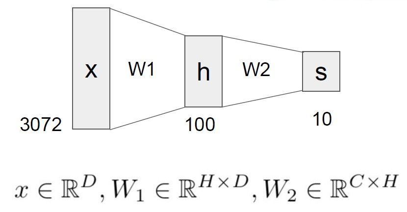
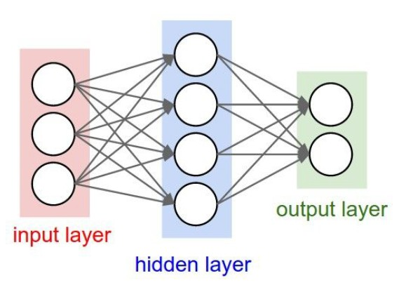
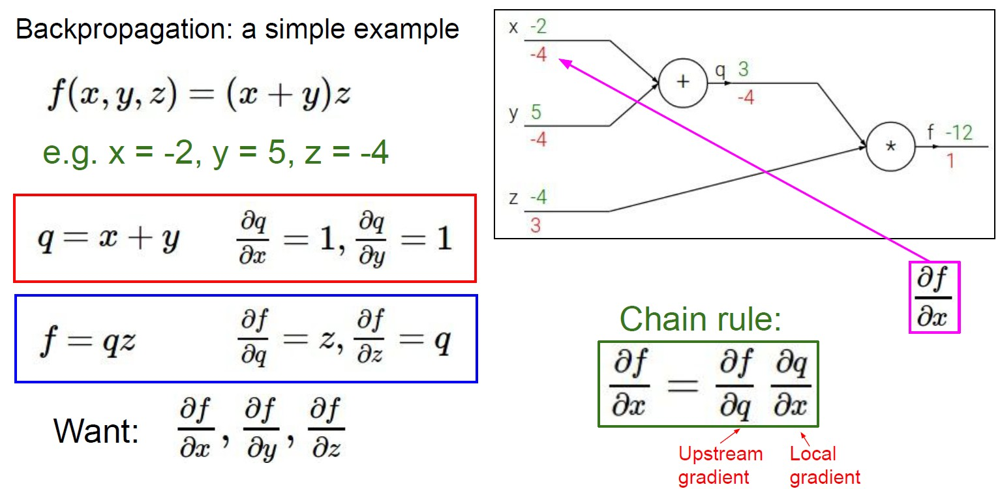
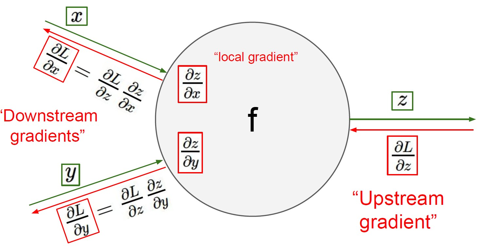
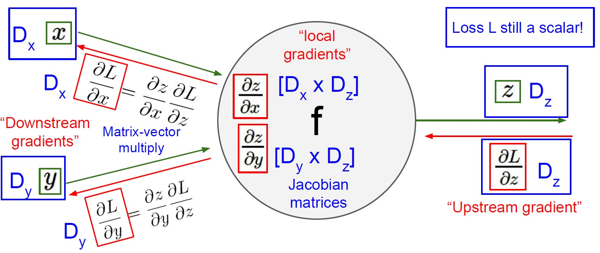
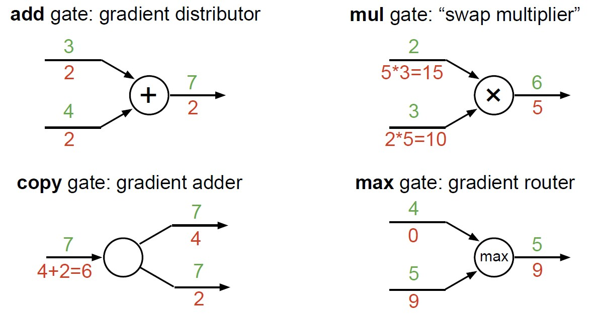

# Neural Networks and Backpropagation

## Neural Networks

### Stochastic Gradient Descent (SGD)

- 简单来说，之前的梯度下降每次要对所有的样本求和，这样计算量太大，所以可以每次随机使用一小批样本进行更新，计算量更小
- using a **minibatch** of examples, 32 / 64 / 128 is common

### Fully connected Network

- A particular 2-layer Neural Network:
  $$
    f = W_2 \max(0,W_1 x)
  $$
  This is called **fully-connected networks** or **multi-layer perceptrons (MLP)**

  - $h$ is called **hidden layer**
- the function $\max(0,z)$ is called the **activation function**
  - add non-linearity to linear model
- more neurons = more capacity

## Backpropagation

- Downstream gradients = local gradient $\times$ Upstream gradient (using the **chain rule**)
  - backprop with scalars:

  - backprop with vectors:

- 反向传播实际上做的就是，通过计算图反推而不是直接计算梯度(因为根据模型的不同没有一个通用的解，且模型中的非线性部分也难以求导)，可以做到对任意的网络皆可计算其梯度  
  反向传播计算得到的值，表示该节点的元素改变将会怎样影响损失函数
- 部分节点的反向传播计算方法

